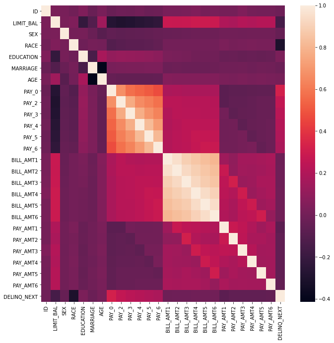

# GWU_SCB_DNSC_6301_Project

**Bascis Information**
- Person or organization developinhg model: Group 6 - Sekou Cheick Bamba
- Model Date: August 2021
- Model version: 1.0
- Model implementation code: [SCB_GWU.ipynb](SCB_GWU.ipynb])

**Intended Use**
- Primary intended uses: This model is an example probability of default classifier, with an example use case for determining eligibility for a credit line increase.
- Primary intended users: Students in GWU DNSC 6301 Bootcamp and MBA Data Analytics.
- Out-of-scope use cases: Any use beyond an eduacational example is out-of-scope.

**Training Data**:
- Data dictionary:

| Name | Modeling Role | Measurement Level| Description|
| ---- | ------------- | ---------------- | ---------- |
|**ID**| ID | int | unique row indentifier |
| **LIMIT_BAL** | input | float | amount of previously awarded credit |
| **SEX** | demographic information | int | 1 = male; 2 = female
| **RACE** | demographic information | int | 1 = hispanic; 2 = black; 3 = white; 4 = asian |
| **EDUCATION** | demographic information | int | 1 = graduate school; 2 = university; 3 = high school; 4 = others |
| **MARRIAGE** | demographic information | int | 1 = married; 2 = single; 3 = others |
| **AGE** | demographic information | int | age in years |
| **PAY_0, PAY_2 - PAY_6** | inputs | int | history of past payment; PAY_0 = the repayment status in September, 2005; PAY_2 = the repayment status in August, 2005; ...; PAY_6 = the repayment status in April, 2005. The measurement scale for the repayment status is: -1 = pay duly; 1 = payment delay for one month; 2 = payment delay for two months; ...; 8 = payment delay for eight months; 9 = payment delay for nine months and above |
| **BILL_AMT1 - BILL_AMT6** | inputs | float | amount of bill statement; BILL_AMNT1 = amount of bill statement in September, 2005; BILL_AMT2 = amount of bill statement in August, 2005; ...; BILL_AMT6 = amount of bill statement in April, 2005 |
| **PAY_AMT1 - PAY_AMT6** | inputs | float | amount of previous payment; PAY_AMT1 = amount paid in September, 2005; PAY_AMT2 = amount paid in August, 2005; ...; PAY_AMT6 = amount paid in April, 2005 |
| **DELINQ_NEXT**| target | int | whether a customer's next payment is delinquent (late), 1 = late; 0 = on-time |

- Source of trainin data: GWU Blackboard, email scbamba@gwu.edu for more information
- How training data was divided into training and validation data: 50% training, 25% validation, 25% test
- Number of rows in training and validation data:
  - Training rows: 15,000
  - Validation rows: 7,500

**Test Data**
- Source of test data: GWU Blackboard, email scbamba@gwu.edu for more information
- Number of rows in test data: 7,500
- State any differences in columns between training and test data: None
- State any differences in rows between training and test data: 15,000 rows for training and 7,500 for test data.

**Model Details**
- Columns used as inputs in the final model: ['LIMIT_BAL', 'PAY_0', 'PAY_2', 'PAY_3', 'PAY_4', 'PAY_5', 'PAY_6', 'BILL_AMT1', 'BILL_AMT2', 'BILL_AMT3', 'BILL_AMT4', 'BILL_AMT5', 'BILL_AMT6', 'PAY_AMT1', 'PAY_AMT2', 'PAY_AMT3', 'PAY_AMT4', 'PAY_AMT5', 'PAY_AMT6']
- Column(s) used as target(s) in the final model: 'DELINQ_NEXT'
- Type of model: Random Forrest
- Software used to implement the model: Python Scikit-learn
- Version of the modeling software: 0.22.2.post1
- Hyperparameters or other setting of your model: DecisionTreeClassifier(ccp_alpha=0.0, class_weight=None, criterion='gini',
                       max_depth=6, max_features=None, max_leaf_nodes=None,
                       min_impurity_decrease=0.0, min_impurity_split=None,
                       min_samples_leaf=1, min_samples_split=2,
                       min_weight_fraction_leaf=0.0, presort='deprecated',
                       random_state=12345, splitter='best')

**Quantitative Analysis

**Ethical considerations
- Describe potential negative impacts of using the model:
  - The model will not work effectively on Safari. User shall use Google Chrome.
  - Real-world risks: even though this model framework is consistent this is for academic purpose. It cannot be use for real-world environment.
- Describe potential uncertainties relating to the impacts of using your model:
  - The outcome of using this model is striclty acamdeci. We will not guarantee an utilization outside of class demonstration. 
  - Real-world risks: all users shall understand that this is an example of model. Nowhere this shall be considerated over his intended purpose.
- Describe any unexpected or results: None
